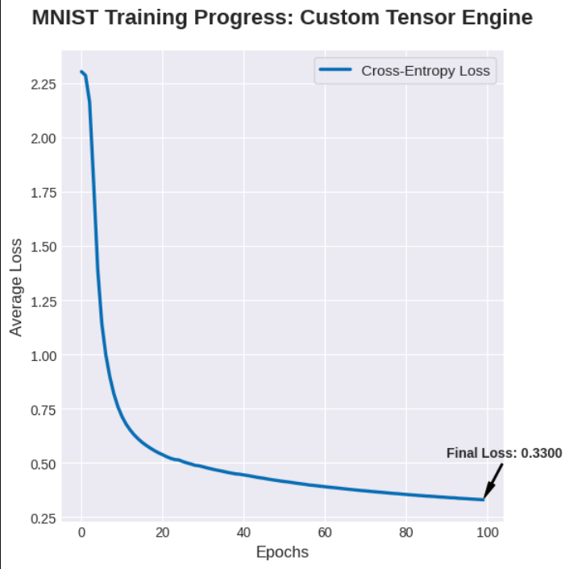
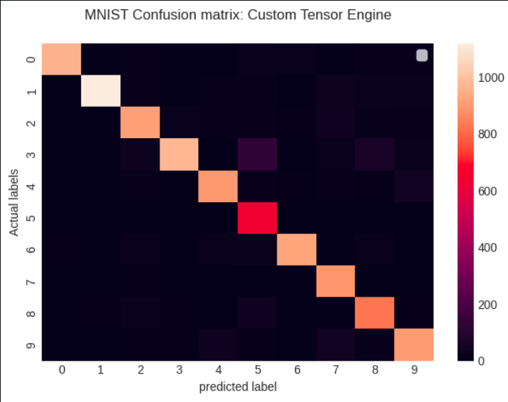

# Dual-Engine Automatic Differentiation Suite

This project contains two independently developed engines for automatic differentiation: a **Forward Mode** engine using Dual Numbers and a **Backward Mode** engine utilizing a custom 2D-Tensor library. The Backward engine was used to train a neural network on the MNIST dataset, achieving over **90% accuracy**.

---

## 🛠️ Implementation Details

### Backward Mode Engine
* **2D-Strict Tensor Library**: I designed the `Tensor` class to enforce a strict 2D-matrix constraint for all operations (even scalars are $1 \times 1$), eliminating common dimension-mismatch errors in NumPy.
* **Gradient Calculation**: For the output layer, I implemented the simplified gradient shortcut for Cross-Entropy combined with Softmax:
  $$\text{logit.grad} = \hat{y} - y$$
  where $\hat{y}$ is the predicted probability matrix and $y$ is the one-hot encoded ground truth.
* **Dynamic Graph Construction**: The engine builds a Directed Acyclic Graph (DAG) during the forward pass, allowing for recursive gradient computation during the `.backward()` call.

### Forward Mode Engine
* **Dual Number Arithmetic**: I implemented a custom `Dual` class to handle derivatives alongside values.
* **Operator Overloading**: Every mathematical operation was overloaded to compute the derivative of the function exactly in a single pass without truncation errors.

---

## 📈 Results & Metrics

The Backward engine was used to train a 2-layer neural network ($784 \rightarrow 128 \rightarrow 10$) on 60,000 images for 100 epochs.

| Metric | Result |
| :--- | :--- |
| **Accuracy** | **90.44%** |
| **Precision** | **91.22%** |
| **Recall** | **90.44%** |
| **Final Loss** | **0.33** |

### Training Progress
The following plot shows the average loss per epoch during the training phase.

### Class Performance
The confusion matrix below highlights the specific digit-to-digit performance across the 10,000 test samples.

---

## 💻 Project Execution
* **Optimization**: I used Stochastic Gradient Descent (SGD) with a learning rate of 0.01.

* **Quick Start**: You can run the `experimentation.ipynb` notebook to execute the full pipeline; it will automatically handle model training, validation, and the plotting of all performance charts.

* **Testing**: Validation was performed on a separate 10,000 image test set to ensure the model generalizes beyond the training data.